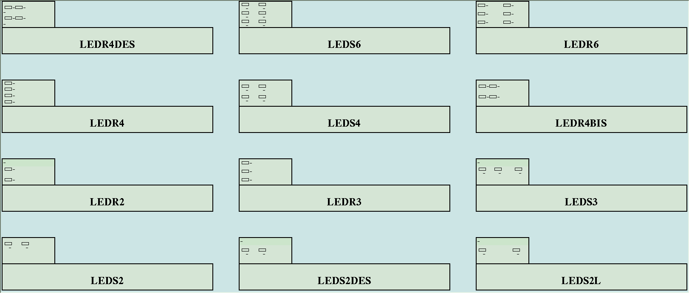
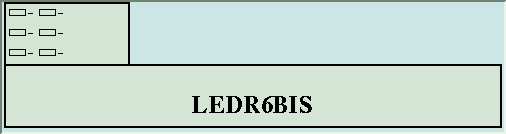
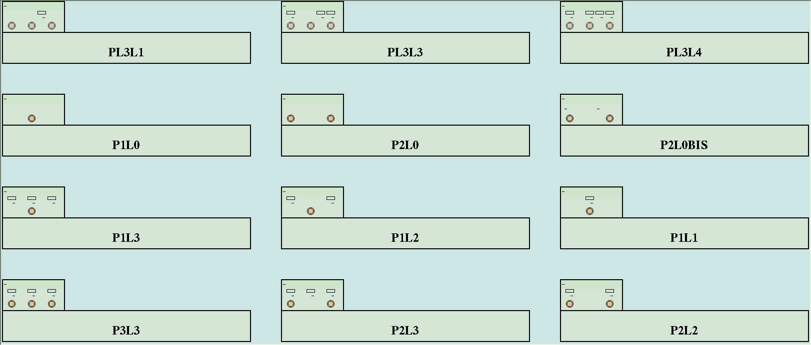
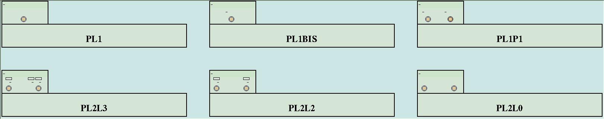
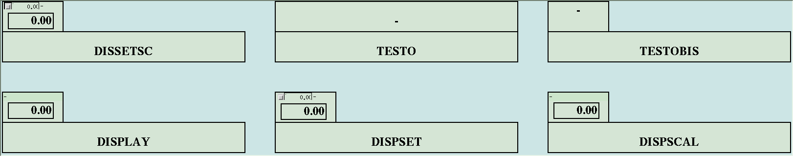
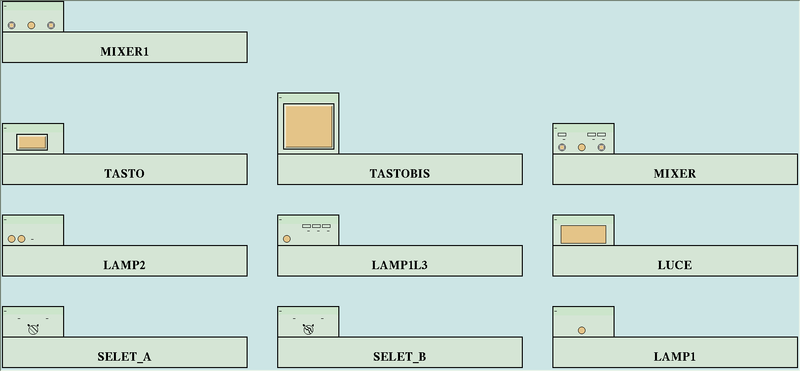
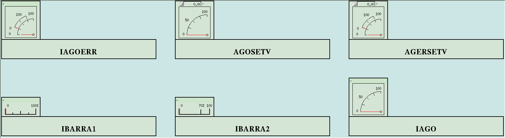
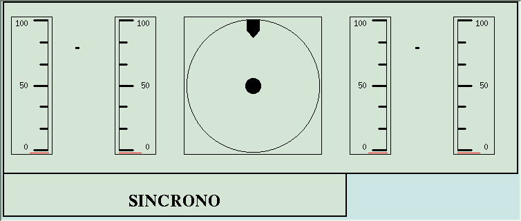

# HOWTO — Faceplate di comando: da `r01.dat` al simulatore

Guida operativa per costruire le pagine di **faceplate di comando** di un
simulatore LegoPST: si scrive un file di testo `r01.dat`, lo si compila con
`compstaz` e lo si visualizza con `xstaz`.

> **In cinque righe**
> ```sh
> cd $KSIM/<task-di-regolazione>     # qui stanno r01.dat e variabili.rtf
> compstaz                           # compila -> r02.dat  (+ compstaz.log)
> grep -i attenzione compstaz.log    # zero righe = compilazione pulita
> lghmi                              # selettore: processo + faceplate
> #   ...oppure a mano:
> xstaz 1 &                          # visualizzatore (parte iconificato)
> stazpag                            # elenca le pagine
> stazpag RISCBP                     # ne apre una
> ```

## 1. I tre concetti

| Concetto | Cos'è |
|---|---|
| **Oggetto** | il singolo widget: un LED, un pulsante, un display, un impostatore |
| **Stazione** | il faceplate: un gruppo fisso di oggetti, di un **tipo** predefinito (`P3L3`, `AGERSETV`, …) |
| **Pagina** | il quadro: un insieme di stazioni disposte su una griglia di celle |

I tipi di stazione **non si inventano**: sono un catalogo chiuso, definito nel
codice ([newstaz.h](../../../AlgLib/libinclude/newstaz.h)). Scegliere un tipo
significa accettare *quali* oggetti contiene e *in che ordine* vanno descritti.
Il capitolo 6 elenca tutti i tipi con il loro template.

## 2. I due programmi e i due file

```
   r01.dat  ──compstaz──▶  r02.dat  ──xstaz──▶  faceplate a video
   (testo,                 (binario)            (Motif)
    scritto a mano)
```

| | `compstaz` | `xstaz` |
|---|---|---|
| Dove | `Alg_rt/bin` | `Alg_rt/bin` |
| Argomenti | **nessuno** | `tipo_staz`: `1` = MONIT, `0` = LEGOGRAF (VMS, morto su Linux) |
| Legge | `r01.dat` + `variabili.rtf` nella **cwd** | `r02.dat` nella **cwd** |
| Scrive | `r02.dat`, `compstaz.log` | niente |
| Ambiente | `SHR_USR_KEY` | `DISPLAY`, `SHR_USR_KEY`, `SHR_TAV_KEY`, `LEGORT_BIN` |

Entrambi lavorano **solo nella directory corrente**: non esiste un'opzione per
indicare i file altrove. Il compilatore si chiama `compstaz` (non *xcompstz*);
esiste anche `Alg_mmi/bin/convstaz`, che mangia lo stesso `r01.dat` ma genera le
pagine per LEGOMMI invece del binario per `xstaz`.

**Perché serve `variabili.rtf`**: ogni riga `INPUT`/`OUTPUT` cita una variabile e
un modello, che `compstaz` risolve contro la **topologia del simulatore**, tenuta
in shared memory alla chiave `SHR_USR_KEY + 5` e dimensionata su `variabili.rtf`.
Se il nome non esiste, la compilazione si ferma.

## 3. Struttura di `r01.dat`

File di testo puro. I record sono separati da una riga contenente **solo quattro
asterischi**, e il file finisce con `END_OF_FILE`:

```
****
PAGINA
   ...
****
STAZIONE
   ...
****
STAZIONE
   ...
****
END_OF_FILE
```

Regole generali:

- ogni riga è `PAROLA_CHIAVE  valore1 valore2 …`, separatori spazi o tabulazioni;
- l'**ordine delle righe è obbligatorio**: il compilatore le legge in sequenza e
  se non trova quella che si aspetta si ferma;
- le righe si possono lasciare **senza valori** (es. `INPUT_BLINK` da solo)
  quando quel collegamento non serve;
- nessun commento è previsto: qualsiasi riga inattesa è un errore.

## 4. Il record `PAGINA`

```
****
PAGINA
NUMERO       1
NOME         RISCBP
DESCRIZIONE  Livello RISCALDATORI BP
```

| Riga | Obbligo | Significato |
|---|---|---|
| `NUMERO` | sì | identificatore 1..500 citato dalle stazioni. **Non serve che i numeri siano contigui**: `compstaz` tiene una tabella di svincolo fra numero dichiarato e indice reale. Numero ripetuto = errore |
| `NOME` | sì | nome della pagina; è quello che `net_monit` invia a `xstaz` per aprirla |
| `DESCRIZIONE` | sì | testo libero mostrato nell'elenco di `net_monit` accanto al nome |

Tutte le pagine vanno dichiarate **prima** delle stazioni che le citano? No: si
possono mettere in qualunque ordine, perché lo svincolo viene risolto alla fine.
Però una stazione che cita una pagina mai dichiarata è un errore fatale.

## 5. Il record `STAZIONE`

```
****
STAZIONE
NUMERO       1
TIPO         DISPSCAL
DESCRIZIONE  set di livello
PAGINA       1
POSIZIONE    1   11
<blocco oggetto 1>
<blocco oggetto 2>
...
```

| Riga | Significato |
|---|---|
| `NUMERO` | **ignorato**: l'indice reale è la posizione progressiva della stazione nel file. Si scrive per leggibilità, e si può lasciare vuoto |
| `TIPO` | uno dei tipi del catalogo (capitolo 6). Tipo sconosciuto = errore |
| `DESCRIZIONE` | testo libero; la riga deve esserci anche vuota |
| `PAGINA` | numero della pagina che la ospita (quello dichiarato in `NUMERO` della pagina) |
| `POSIZIONE` | `x y` in **celle**, non pixel. Larghezza e altezza le impone il tipo |

Dopo `POSIZIONE` seguono i blocchi degli oggetti, **nella sequenza esatta che il
tipo dichiara**: né uno di meno, né in ordine diverso. Se sbagli, `compstaz` ti
dice quale si aspettava (`oggetto previsto: LED`) ed esce.

Ogni blocco comincia con la riga che nomina l'oggetto (`LED`, `PULSANTE`,
`SET_VALORE`, …) seguita dalle sue righe di parametri. Eventuali valori scritti
**sulla stessa riga del nome dell'oggetto vengono ignorati**: nei file storici si
trova `SET_VALORE   1.`, ma il compilatore legge un solo token.

## 6. Le righe degli oggetti

Sono le stesse per tutti gli oggetti che le usano.

### `COLORE <nome>`

Colore acceso del LED/lampada/pulsante. Ammessi: `NERO`, `BIANCO`, `GIALLO`,
`VERDE`, `ROSSO`, `GRIGIO`, `BLU`.

### `ETICHETTA <testo>`

Testo mostrato. Prende **tutto il resto della riga**, spazi inclusi.

### `INPUT <variabile> <modello>`

Grandezza letta dalla simulazione e mostrata dall'oggetto. `<modello>` è il nome
del modello (task) a cui la variabile appartiene, risolto sulla topologia; la
parola letterale `modello` vale come "nessun modello specifico". Variabile o
modello inesistenti fermano la compilazione con
`IL MODELLO xxx CITATO ALLA RIGA n NON ESISTE`.

### `INPUT_ERR`, `INPUT_BLINK`

Stessa sintassi di `INPUT`. `INPUT_ERR` è il valore "di errore" mostrato in
sovrapposizione dagli indicatori a doppio indice; `INPUT_BLINK` è la condizione
che fa **lampeggiare** la segnalazione. Si lasciano **senza argomenti** quando non
servono — la riga però deve esserci.

### `OUTPUT <variabile> <modello> <modo>`

È la riga che rende il faceplate **di comando**: dice cosa scrive nel simulatore.
Il `<modo>` è la modalità di perturbazione:

| Modo | Effetto |
|---|---|
| `STEP` | impone il valore digitato/impostato (gradino) |
| `IMPULSO` | manda un impulso: la variabile torna da sola allo stato di riposo |
| `NEGAZIONE` | commuta lo stato logico (tipico dei pulsanti on/off) |
| `UP_DOWN` | incrementa/decrementa in modo continuo finché il comando è premuto |

`OUTPUT` **senza argomenti** lascia il comando scollegato: l'oggetto si vede ma
non agisce (utile per abbozzare una pagina prima di avere le variabili).

### `SCALAMENTO <a>` e `OFFSET <b>`

Conversione fra unità interne del modello e unità mostrate:
`visualizzato = a * valore + b`. Tipico: `SCALAMENTO 100.` e `OFFSET 0.` per
mostrare in percentuale una grandezza normalizzata 0..1.

### `MINMAX <min> <max>`

Fondoscala dell'indicatore, **in unità visualizzate**.

### `SCALAMENTO_ERR`, `MINMAX_ERR`

Come sopra ma per il canale `INPUT_ERR`.

### `INIBIZIONE [<variabile> <modello>]`

Quando la variabile è vera il comando viene **inibito** (l'oggetto si disabilita).
Senza argomenti = mai inibito.

### `NOT`

Si scrive come **quarto campo della riga `INPUT` o `INPUT_BLINK`**, dopo
variabile e modello, e inverte la condizione logica:

```
LED
COLORE       VERDE
ETICHETTA    in servizio
INPUT        JA2S00CI   CICA          <- acceso quando la variabile vale 1
INPUT_BLINK
LED
COLORE       ROSSO
ETICHETTA    fuori servizio
INPUT        JA2S00CI   CICA   NOT    <- acceso quando vale 0
INPUT_BLINK
```

**Vale solo per i quattro oggetti che leggono in logica**: `LED`, `LAMPADA`,
`LUCE`, `PULS_LUCE`. Sono gli unici che chiamano `estr_sh(indice, 1+neg)`, cioè
riducono il valore a 0/1 (`val = |(int)val % 2|`) e, con `NOT`, lo invertono.
Tutti gli altri — `DISPLAY`, `DISPLAY_SCALATO`, `INDICATORE`, `SET_VALORE`,
`SELETTORE`, `INDICATORE_SINCRO` — leggono il valore **analogico** (`funct = 0`)
e un `NOT` lì non ha alcun effetto.

Il confronto è **esatto e maiuscolo**: `is_neg()` accetta solo `NOT`, non `not`
né `Not`. Un campo assente o diverso vale semplicemente "nessuna negazione", e
non produce errore di compilazione: attenzione ai refusi, passano inosservati.

Attenzione anche a un caso che sembra ovvio e non lo è: su un ingresso
**scollegato** (riga vuota o `#`, indice -1) `estr_sh()` restituisce 0 **prima**
di applicare la negazione. Un `NOT` su un riferimento scollegato quindi non
accende nulla.

### Costruire una pagina per gradi: riferimenti non collegati

`compstaz` risolve ogni `INPUT`/`OUTPUT` contro la topologia e si ferma al primo
nome che non esiste. Per mettere a punto una pagina prima di avere le variabili
ci sono due strade, e **non sono equivalenti**.

**1. Lasciare la riga senza argomenti — è la strada giusta.** Ogni riga di
variabile ammette la forma nuda:

```
LED
COLORE       VERDE
ETICHETTA    AUTO
INPUT
INPUT_BLINK
```

Il compilatore registra l'indice **-1**, e a runtime `estr_sh()` ha la guardia
esplicita `if (indice == -1) return(0.);`: l'oggetto mostra **zero** (LED spento,
display a 0). Sul lato comando i lettori fanno `if (p_r02->out.indice == -1)
return;`, quindi il pulsante c'è, si preme e **non fa nulla**. Nessun effetto
collaterale sulla simulazione.

Vale per tutti gli oggetti: `INPUT`, `INPUT_ERR`, `INPUT_BLINK`, `OUTPUT`,
`INIBIZIONE`. Attenzione: la scappatoia scatta solo se la riga è **davvero**
priva di argomenti — variabile *e* modello. Se ne scrivi uno solo, il
compilatore prende l'altro ramo e pretende nomi validi.

**2. Commentare il nome con `#` — quando il nome lo vuoi tenere.** Un `#` come
primo carattere annulla il riferimento esattamente come la riga vuota (indice
-1), ma lascia scritto in chiaro quale variabile ci andrà:

```
LED
COLORE       GIALLO
ETICHETTA    AUTO
INPUT        #U1094FSL   CICA
INPUT_BLINK
```

Vale sia per il nome della **variabile** sia per quello del **modello**, e basta
commentarne uno: se è commentato il modello il riferimento resta scollegato
comunque, perché senza modello la variabile non è risolvibile. Quando poi la
variabile esiste, togli il `#` e ricompili.

Il `#` **non allenta i controlli**: un nome non commentato che non esiste ferma
la compilazione come sempre. Il marcatore è riconosciuto sia da `compstaz` sia
dal compilatore gemello `convstaz`, così lo stesso `r01.dat` si comporta allo
stesso modo con entrambi.

**3. I due nomi segnaposto storici**, per quando un pezzo lo vuoi già scritto:

| Segnaposto | Dove va | Effetto |
|---|---|---|
| `variabil` | al posto del nome della variabile | l'indice diventa **0** |
| `modello` | al posto del nome del modello | il modello diventa **0** |

Sono riconosciuti da `check_input`, `check_output` e `check_model`
([checkvar.c](../compstaz/checkvar.c)) con un confronto **esatto**: minuscoli e
scritti così, `variabil` senza la "e" finale.

```
DISPLAY_SCALATO
INPUT        variabil   modello
SCALAMENTO      1.
OFFSET          0.
```

**Ma l'indice 0 è un indirizzo vero**, non un "non collegato": a runtime
l'oggetto legge il primo punto del database e mostra quel valore, che non
significa nulla. Sono rimasti per compatibilità con i file storici: per un
faceplate non ancora cablato usa la riga vuota o il `#`, che danno -1.

**Cosa continua a essere verificato comunque.** Restare "scollegati" non salta
gli altri controlli: i tipi di stazione devono esistere, i blocchi degli oggetti
essere completi e nell'ordine giusto, le pagine citate essere dichiarate, e la
geometria non deve sovrapporsi — `compstaz` rifiuta con *"ATTENZIONE:
sovrapposizione di stazioni"* due stazioni che si pestano i piedi, tenendo conto
dell'ingombro in celle di ciascun tipo (capitolo 7).

## 7. Catalogo delle stazioni

> **Come si vedono davvero.** Ogni famiglia qui sotto si apre con la cattura di
> schermo dei suoi tipi, ognuno col nome scritto sotto. Sono immagini reali di
> `xstaz`, non disegni: le produce il `r01.dat` di sola consultazione in
> [catalogo/](catalogo/), che si compila in qualsiasi task perché ha tutti i
> riferimenti scollegati (nessun modello richiesto). Per vederlo dal vivo:
> `compstaz` e poi `lghmi -staz`.

54 tipi. La tabella riassume composizione e ingombro; sotto, il template pronto
da copiare per ognuno. Nei template `<...>` sono i valori da sostituire e
`[...]` indica una riga che può restare senza argomenti.

> **Nota sui sottotipi.** `INDICATORE` è l'unico oggetto le cui righe dipendono
> dal sottotipo fissato dal tipo di stazione: `SCALAMENTO_ERR`, `MINMAX_ERR` e
> `INPUT_ERR` si leggono **solo** con `INDIC_AGO_ERR`, cioè in `IAGOERR` e
> `AGERSETV`. In `IBARRA1`, `IBARRA2`, `IAGO`, `AGOSETV` e `SINCRONO`
> l'indicatore ha le sole `SCALAMENTO`, `MINMAX`, `OFFSET`, `INPUT`. I template
> qui sotto ne tengono conto.

| Tipo | Celle (L x A) | Oggetti che lo compongono |
|---|---|---|
| `LEDS2` | 2 x 1 | LED, LED |
| `LEDS2DES` | 2 x 1 | STRINGA, LED, LED |
| `LEDS2L` | 2 x 1 | STRINGA, LED, LED |
| `LEDR2` | 2 x 1 | STRINGA, LED, LED |
| `LEDR3` | 2 x 1 | LED, LED, LED |
| `LEDS3` | 2 x 1 | STRINGA, LED, LED, LED |
| `LEDR4` | 2 x 1 | LED, LED, LED, LED |
| `LEDS4` | 2 x 1 | LED, LED, LED, LED |
| `LEDR4BIS` | 2 x 1 | LED, LED, LED, LED |
| `LEDR4DES` | 2 x 1 | STRINGA, STRINGA, LED, LED, LED, LED |
| `LEDS6` | 2 x 1 | LED, LED, LED, LED, LED, LED |
| `LEDR6` | 2 x 1 | LED, LED, LED, LED, LED, LED |
| `LEDR6BIS` | 2 x 1 | LED, LED, LED, LED, LED, LED |
| `SELET_A` | 2 x 1 | STRINGA, SELETTORE |
| `SELET_B` | 2 x 1 | STRINGA, SELETTORE |
| `IBARRA1` | 2 x 1 | STRINGA, INDICATORE |
| `IBARRA2` | 2 x 1 | STRINGA, INDICATORE |
| `IAGO` | 2 x 2 | STRINGA, INDICATORE |
| `AGOSETV` | 2 x 2 | SET_VALORE, INDICATORE |
| `IAGOERR` | 2 x 2 | STRINGA, INDICATORE |
| `AGERSETV` | 2 x 2 | SET_VALORE, INDICATORE |
| `DISPLAY` | 2 x 1 | STRINGA, DISPLAY |
| `DISPSET` | 2 x 1 | SET_VALORE, DISPLAY |
| `DISSETSC` | 2 x 1 | SET_VALORE, DISPLAY_SCALATO |
| `LUCE` | 2 x 1 | STRINGA, LUCE |
| `TASTO` | 2 x 1 | STRINGA, TASTO |
| `TASTOBIS` | 2 x 2 | STRINGA, TASTO |
| `P3L3` | 2 x 1 | STRINGA, LED, LED, LED, PULSANTE, PULSANTE, PULSANTE |
| `P2L3` | 2 x 1 | STRINGA, LED, LED, LED, PULSANTE, PULSANTE |
| `P2L2` | 2 x 1 | STRINGA, LED, LED, PULSANTE, PULSANTE |
| `P1L3` | 2 x 1 | STRINGA, LED, LED, LED, PULSANTE |
| `P1L2` | 2 x 1 | STRINGA, LED, LED, PULSANTE |
| `P1L1` | 2 x 1 | STRINGA, LED, PULSANTE |
| `P1L0` | 2 x 1 | STRINGA, PULSANTE |
| `P2L0` | 2 x 1 | STRINGA, PULSANTE, PULSANTE |
| `P2L0BIS` | 2 x 1 | STRINGA, STRINGA, STRINGA, PULSANTE, PULSANTE |
| `PL3L1` | 2 x 1 | STRINGA, LED, PULS_LUCE, PULS_LUCE, PULS_LUCE |
| `PL3L3` | 2 x 1 | STRINGA, LED, LED, LED, PULS_LUCE, PULS_LUCE, PULS_LUCE |
| `PL3L4` | 2 x 1 | STRINGA, LED, LED, LED, LED, PULS_LUCE, PULS_LUCE, PULS_LUCE |
| `PL2L3` | 2 x 1 | STRINGA, LED, LED, LED, PULS_LUCE, PULS_LUCE |
| `PL2L2` | 2 x 1 | STRINGA, LED, LED, PULS_LUCE, PULS_LUCE |
| `PL2L0` | 2 x 1 | STRINGA, PULS_LUCE, PULS_LUCE |
| `PL1` | 2 x 1 | STRINGA, PULS_LUCE |
| `PL1BIS` | 2 x 1 | STRINGA, STRINGA, PULS_LUCE |
| `PL1P1` | 2 x 1 | STRINGA, STRINGA, STRINGA, PULS_LUCE, PULSANTE |
| `LAMP1` | 2 x 1 | STRINGA, LAMPADA |
| `LAMP2` | 2 x 1 | STRINGA, STRINGA, LAMPADA, LAMPADA |
| `LAMP1L3` | 2 x 1 | STRINGA, LED, LED, LED, LAMPADA |
| `MIXER` | 2 x 1 | STRINGA, LED, LED, LED, PULS_LUCE, LAMPADA, PULS_LUCE |
| `MIXER1` | 2 x 1 | STRINGA, PULS_LUCE, LAMPADA, PULS_LUCE |
| `TESTO` | 8 x 1 | STRINGA |
| `TESTOBIS` | 2 x 1 | STRINGA |
| `DISPSCAL` | 2 x 1 | STRINGA, DISPLAY_SCALATO |
| `SINCRONO` | 12 x 4 | STRINGA, STRINGA, INDICATORE, INDICATORE, INDICATORE, INDICATORE, INDICATORE_SINCRO |

### Segnalazioni a LED




#### `LEDS2` — 2 oggetti, 2x1 celle

```
****
STAZIONE
NUMERO       <n>
TIPO         LEDS2
DESCRIZIONE  <testo libero>
PAGINA       <numero pagina>
POSIZIONE    <x>   <y>
LED
COLORE       GIALLO
ETICHETTA    <testo>
INPUT        <var> <modello>
INPUT_BLINK  [<var> <modello>]
LED
COLORE       GIALLO
ETICHETTA    <testo>
INPUT        <var> <modello>
INPUT_BLINK  [<var> <modello>]
```

#### `LEDS2DES` — 3 oggetti, 2x1 celle

```
****
STAZIONE
NUMERO       <n>
TIPO         LEDS2DES
DESCRIZIONE  <testo libero>
PAGINA       <numero pagina>
POSIZIONE    <x>   <y>
STRINGA
ETICHETTA    <testo>
LED
COLORE       GIALLO
ETICHETTA    <testo>
INPUT        <var> <modello>
INPUT_BLINK  [<var> <modello>]
LED
COLORE       GIALLO
ETICHETTA    <testo>
INPUT        <var> <modello>
INPUT_BLINK  [<var> <modello>]
```

#### `LEDS2L` — 3 oggetti, 2x1 celle

```
****
STAZIONE
NUMERO       <n>
TIPO         LEDS2L
DESCRIZIONE  <testo libero>
PAGINA       <numero pagina>
POSIZIONE    <x>   <y>
STRINGA
ETICHETTA    <testo>
LED
COLORE       GIALLO
ETICHETTA    <testo>
INPUT        <var> <modello>
INPUT_BLINK  [<var> <modello>]
LED
COLORE       GIALLO
ETICHETTA    <testo>
INPUT        <var> <modello>
INPUT_BLINK  [<var> <modello>]
```

#### `LEDR2` — 3 oggetti, 2x1 celle

```
****
STAZIONE
NUMERO       <n>
TIPO         LEDR2
DESCRIZIONE  <testo libero>
PAGINA       <numero pagina>
POSIZIONE    <x>   <y>
STRINGA
ETICHETTA    <testo>
LED
COLORE       GIALLO
ETICHETTA    <testo>
INPUT        <var> <modello>
INPUT_BLINK  [<var> <modello>]
LED
COLORE       GIALLO
ETICHETTA    <testo>
INPUT        <var> <modello>
INPUT_BLINK  [<var> <modello>]
```

#### `LEDR3` — 3 oggetti, 2x1 celle

```
****
STAZIONE
NUMERO       <n>
TIPO         LEDR3
DESCRIZIONE  <testo libero>
PAGINA       <numero pagina>
POSIZIONE    <x>   <y>
LED
COLORE       GIALLO
ETICHETTA    <testo>
INPUT        <var> <modello>
INPUT_BLINK  [<var> <modello>]
LED
COLORE       GIALLO
ETICHETTA    <testo>
INPUT        <var> <modello>
INPUT_BLINK  [<var> <modello>]
LED
COLORE       GIALLO
ETICHETTA    <testo>
INPUT        <var> <modello>
INPUT_BLINK  [<var> <modello>]
```

#### `LEDS3` — 4 oggetti, 2x1 celle

```
****
STAZIONE
NUMERO       <n>
TIPO         LEDS3
DESCRIZIONE  <testo libero>
PAGINA       <numero pagina>
POSIZIONE    <x>   <y>
STRINGA
ETICHETTA    <testo>
LED
COLORE       GIALLO
ETICHETTA    <testo>
INPUT        <var> <modello>
INPUT_BLINK  [<var> <modello>]
LED
COLORE       GIALLO
ETICHETTA    <testo>
INPUT        <var> <modello>
INPUT_BLINK  [<var> <modello>]
LED
COLORE       GIALLO
ETICHETTA    <testo>
INPUT        <var> <modello>
INPUT_BLINK  [<var> <modello>]
```

#### `LEDR4` — 4 oggetti, 2x1 celle

```
****
STAZIONE
NUMERO       <n>
TIPO         LEDR4
DESCRIZIONE  <testo libero>
PAGINA       <numero pagina>
POSIZIONE    <x>   <y>
LED
COLORE       GIALLO
ETICHETTA    <testo>
INPUT        <var> <modello>
INPUT_BLINK  [<var> <modello>]
LED
COLORE       GIALLO
ETICHETTA    <testo>
INPUT        <var> <modello>
INPUT_BLINK  [<var> <modello>]
LED
COLORE       GIALLO
ETICHETTA    <testo>
INPUT        <var> <modello>
INPUT_BLINK  [<var> <modello>]
LED
COLORE       GIALLO
ETICHETTA    <testo>
INPUT        <var> <modello>
INPUT_BLINK  [<var> <modello>]
```

#### `LEDS4` — 4 oggetti, 2x1 celle

```
****
STAZIONE
NUMERO       <n>
TIPO         LEDS4
DESCRIZIONE  <testo libero>
PAGINA       <numero pagina>
POSIZIONE    <x>   <y>
LED
COLORE       GIALLO
ETICHETTA    <testo>
INPUT        <var> <modello>
INPUT_BLINK  [<var> <modello>]
LED
COLORE       GIALLO
ETICHETTA    <testo>
INPUT        <var> <modello>
INPUT_BLINK  [<var> <modello>]
LED
COLORE       GIALLO
ETICHETTA    <testo>
INPUT        <var> <modello>
INPUT_BLINK  [<var> <modello>]
LED
COLORE       GIALLO
ETICHETTA    <testo>
INPUT        <var> <modello>
INPUT_BLINK  [<var> <modello>]
```

#### `LEDR4BIS` — 4 oggetti, 2x1 celle

```
****
STAZIONE
NUMERO       <n>
TIPO         LEDR4BIS
DESCRIZIONE  <testo libero>
PAGINA       <numero pagina>
POSIZIONE    <x>   <y>
LED
COLORE       GIALLO
ETICHETTA    <testo>
INPUT        <var> <modello>
INPUT_BLINK  [<var> <modello>]
LED
COLORE       GIALLO
ETICHETTA    <testo>
INPUT        <var> <modello>
INPUT_BLINK  [<var> <modello>]
LED
COLORE       GIALLO
ETICHETTA    <testo>
INPUT        <var> <modello>
INPUT_BLINK  [<var> <modello>]
LED
COLORE       GIALLO
ETICHETTA    <testo>
INPUT        <var> <modello>
INPUT_BLINK  [<var> <modello>]
```

#### `LEDR4DES` — 6 oggetti, 2x1 celle

```
****
STAZIONE
NUMERO       <n>
TIPO         LEDR4DES
DESCRIZIONE  <testo libero>
PAGINA       <numero pagina>
POSIZIONE    <x>   <y>
STRINGA
ETICHETTA    <testo>
STRINGA
ETICHETTA    <testo>
LED
COLORE       GIALLO
ETICHETTA    <testo>
INPUT        <var> <modello>
INPUT_BLINK  [<var> <modello>]
LED
COLORE       GIALLO
ETICHETTA    <testo>
INPUT        <var> <modello>
INPUT_BLINK  [<var> <modello>]
LED
COLORE       GIALLO
ETICHETTA    <testo>
INPUT        <var> <modello>
INPUT_BLINK  [<var> <modello>]
LED
COLORE       GIALLO
ETICHETTA    <testo>
INPUT        <var> <modello>
INPUT_BLINK  [<var> <modello>]
```

#### `LEDS6` — 6 oggetti, 2x1 celle

```
****
STAZIONE
NUMERO       <n>
TIPO         LEDS6
DESCRIZIONE  <testo libero>
PAGINA       <numero pagina>
POSIZIONE    <x>   <y>
LED
COLORE       GIALLO
ETICHETTA    <testo>
INPUT        <var> <modello>
INPUT_BLINK  [<var> <modello>]
LED
COLORE       GIALLO
ETICHETTA    <testo>
INPUT        <var> <modello>
INPUT_BLINK  [<var> <modello>]
LED
COLORE       GIALLO
ETICHETTA    <testo>
INPUT        <var> <modello>
INPUT_BLINK  [<var> <modello>]
LED
COLORE       GIALLO
ETICHETTA    <testo>
INPUT        <var> <modello>
INPUT_BLINK  [<var> <modello>]
LED
COLORE       GIALLO
ETICHETTA    <testo>
INPUT        <var> <modello>
INPUT_BLINK  [<var> <modello>]
LED
COLORE       GIALLO
ETICHETTA    <testo>
INPUT        <var> <modello>
INPUT_BLINK  [<var> <modello>]
```

#### `LEDR6` — 6 oggetti, 2x1 celle

```
****
STAZIONE
NUMERO       <n>
TIPO         LEDR6
DESCRIZIONE  <testo libero>
PAGINA       <numero pagina>
POSIZIONE    <x>   <y>
LED
COLORE       GIALLO
ETICHETTA    <testo>
INPUT        <var> <modello>
INPUT_BLINK  [<var> <modello>]
LED
COLORE       GIALLO
ETICHETTA    <testo>
INPUT        <var> <modello>
INPUT_BLINK  [<var> <modello>]
LED
COLORE       GIALLO
ETICHETTA    <testo>
INPUT        <var> <modello>
INPUT_BLINK  [<var> <modello>]
LED
COLORE       GIALLO
ETICHETTA    <testo>
INPUT        <var> <modello>
INPUT_BLINK  [<var> <modello>]
LED
COLORE       GIALLO
ETICHETTA    <testo>
INPUT        <var> <modello>
INPUT_BLINK  [<var> <modello>]
LED
COLORE       GIALLO
ETICHETTA    <testo>
INPUT        <var> <modello>
INPUT_BLINK  [<var> <modello>]
```

#### `LEDR6BIS` — 6 oggetti, 2x1 celle

```
****
STAZIONE
NUMERO       <n>
TIPO         LEDR6BIS
DESCRIZIONE  <testo libero>
PAGINA       <numero pagina>
POSIZIONE    <x>   <y>
LED
COLORE       GIALLO
ETICHETTA    <testo>
INPUT        <var> <modello>
INPUT_BLINK  [<var> <modello>]
LED
COLORE       GIALLO
ETICHETTA    <testo>
INPUT        <var> <modello>
INPUT_BLINK  [<var> <modello>]
LED
COLORE       GIALLO
ETICHETTA    <testo>
INPUT        <var> <modello>
INPUT_BLINK  [<var> <modello>]
LED
COLORE       GIALLO
ETICHETTA    <testo>
INPUT        <var> <modello>
INPUT_BLINK  [<var> <modello>]
LED
COLORE       GIALLO
ETICHETTA    <testo>
INPUT        <var> <modello>
INPUT_BLINK  [<var> <modello>]
LED
COLORE       GIALLO
ETICHETTA    <testo>
INPUT        <var> <modello>
INPUT_BLINK  [<var> <modello>]
```

### Pulsanti con spie




#### `P3L3` — 7 oggetti, 2x1 celle

```
****
STAZIONE
NUMERO       <n>
TIPO         P3L3
DESCRIZIONE  <testo libero>
PAGINA       <numero pagina>
POSIZIONE    <x>   <y>
STRINGA
ETICHETTA    <testo>
LED
COLORE       GIALLO
ETICHETTA    <testo>
INPUT        <var> <modello>
INPUT_BLINK  [<var> <modello>]
LED
COLORE       GIALLO
ETICHETTA    <testo>
INPUT        <var> <modello>
INPUT_BLINK  [<var> <modello>]
LED
COLORE       GIALLO
ETICHETTA    <testo>
INPUT        <var> <modello>
INPUT_BLINK  [<var> <modello>]
PULSANTE
COLORE       GIALLO
OUTPUT       <var> <modello> STEP
PULSANTE
COLORE       GIALLO
OUTPUT       <var> <modello> STEP
PULSANTE
COLORE       GIALLO
OUTPUT       <var> <modello> STEP
```

#### `P2L3` — 6 oggetti, 2x1 celle

```
****
STAZIONE
NUMERO       <n>
TIPO         P2L3
DESCRIZIONE  <testo libero>
PAGINA       <numero pagina>
POSIZIONE    <x>   <y>
STRINGA
ETICHETTA    <testo>
LED
COLORE       GIALLO
ETICHETTA    <testo>
INPUT        <var> <modello>
INPUT_BLINK  [<var> <modello>]
LED
COLORE       GIALLO
ETICHETTA    <testo>
INPUT        <var> <modello>
INPUT_BLINK  [<var> <modello>]
LED
COLORE       GIALLO
ETICHETTA    <testo>
INPUT        <var> <modello>
INPUT_BLINK  [<var> <modello>]
PULSANTE
COLORE       GIALLO
OUTPUT       <var> <modello> STEP
PULSANTE
COLORE       GIALLO
OUTPUT       <var> <modello> STEP
```

#### `P2L2` — 5 oggetti, 2x1 celle

```
****
STAZIONE
NUMERO       <n>
TIPO         P2L2
DESCRIZIONE  <testo libero>
PAGINA       <numero pagina>
POSIZIONE    <x>   <y>
STRINGA
ETICHETTA    <testo>
LED
COLORE       GIALLO
ETICHETTA    <testo>
INPUT        <var> <modello>
INPUT_BLINK  [<var> <modello>]
LED
COLORE       GIALLO
ETICHETTA    <testo>
INPUT        <var> <modello>
INPUT_BLINK  [<var> <modello>]
PULSANTE
COLORE       GIALLO
OUTPUT       <var> <modello> STEP
PULSANTE
COLORE       GIALLO
OUTPUT       <var> <modello> STEP
```

#### `P1L3` — 5 oggetti, 2x1 celle

```
****
STAZIONE
NUMERO       <n>
TIPO         P1L3
DESCRIZIONE  <testo libero>
PAGINA       <numero pagina>
POSIZIONE    <x>   <y>
STRINGA
ETICHETTA    <testo>
LED
COLORE       GIALLO
ETICHETTA    <testo>
INPUT        <var> <modello>
INPUT_BLINK  [<var> <modello>]
LED
COLORE       GIALLO
ETICHETTA    <testo>
INPUT        <var> <modello>
INPUT_BLINK  [<var> <modello>]
LED
COLORE       GIALLO
ETICHETTA    <testo>
INPUT        <var> <modello>
INPUT_BLINK  [<var> <modello>]
PULSANTE
COLORE       GIALLO
OUTPUT       <var> <modello> STEP
```

#### `P1L2` — 4 oggetti, 2x1 celle

```
****
STAZIONE
NUMERO       <n>
TIPO         P1L2
DESCRIZIONE  <testo libero>
PAGINA       <numero pagina>
POSIZIONE    <x>   <y>
STRINGA
ETICHETTA    <testo>
LED
COLORE       GIALLO
ETICHETTA    <testo>
INPUT        <var> <modello>
INPUT_BLINK  [<var> <modello>]
LED
COLORE       GIALLO
ETICHETTA    <testo>
INPUT        <var> <modello>
INPUT_BLINK  [<var> <modello>]
PULSANTE
COLORE       GIALLO
OUTPUT       <var> <modello> STEP
```

#### `P1L1` — 3 oggetti, 2x1 celle

```
****
STAZIONE
NUMERO       <n>
TIPO         P1L1
DESCRIZIONE  <testo libero>
PAGINA       <numero pagina>
POSIZIONE    <x>   <y>
STRINGA
ETICHETTA    <testo>
LED
COLORE       GIALLO
ETICHETTA    <testo>
INPUT        <var> <modello>
INPUT_BLINK  [<var> <modello>]
PULSANTE
COLORE       GIALLO
OUTPUT       <var> <modello> STEP
```

#### `P1L0` — 2 oggetti, 2x1 celle

```
****
STAZIONE
NUMERO       <n>
TIPO         P1L0
DESCRIZIONE  <testo libero>
PAGINA       <numero pagina>
POSIZIONE    <x>   <y>
STRINGA
ETICHETTA    <testo>
PULSANTE
COLORE       GIALLO
OUTPUT       <var> <modello> STEP
```

#### `P2L0` — 3 oggetti, 2x1 celle

```
****
STAZIONE
NUMERO       <n>
TIPO         P2L0
DESCRIZIONE  <testo libero>
PAGINA       <numero pagina>
POSIZIONE    <x>   <y>
STRINGA
ETICHETTA    <testo>
PULSANTE
COLORE       GIALLO
OUTPUT       <var> <modello> STEP
PULSANTE
COLORE       GIALLO
OUTPUT       <var> <modello> STEP
```

#### `P2L0BIS` — 5 oggetti, 2x1 celle

```
****
STAZIONE
NUMERO       <n>
TIPO         P2L0BIS
DESCRIZIONE  <testo libero>
PAGINA       <numero pagina>
POSIZIONE    <x>   <y>
STRINGA
ETICHETTA    <testo>
STRINGA
ETICHETTA    <testo>
STRINGA
ETICHETTA    <testo>
PULSANTE
COLORE       GIALLO
OUTPUT       <var> <modello> STEP
PULSANTE
COLORE       GIALLO
OUTPUT       <var> <modello> STEP
```

#### `PL3L1` — 5 oggetti, 2x1 celle

```
****
STAZIONE
NUMERO       <n>
TIPO         PL3L1
DESCRIZIONE  <testo libero>
PAGINA       <numero pagina>
POSIZIONE    <x>   <y>
STRINGA
ETICHETTA    <testo>
LED
COLORE       GIALLO
ETICHETTA    <testo>
INPUT        <var> <modello>
INPUT_BLINK  [<var> <modello>]
PULS_LUCE
COLORE       GIALLO
OUTPUT       <var> <modello> STEP
INPUT        <var> <modello>
INPUT_BLINK  [<var> <modello>]
PULS_LUCE
COLORE       GIALLO
OUTPUT       <var> <modello> STEP
INPUT        <var> <modello>
INPUT_BLINK  [<var> <modello>]
PULS_LUCE
COLORE       GIALLO
OUTPUT       <var> <modello> STEP
INPUT        <var> <modello>
INPUT_BLINK  [<var> <modello>]
```

#### `PL3L3` — 7 oggetti, 2x1 celle

```
****
STAZIONE
NUMERO       <n>
TIPO         PL3L3
DESCRIZIONE  <testo libero>
PAGINA       <numero pagina>
POSIZIONE    <x>   <y>
STRINGA
ETICHETTA    <testo>
LED
COLORE       GIALLO
ETICHETTA    <testo>
INPUT        <var> <modello>
INPUT_BLINK  [<var> <modello>]
LED
COLORE       GIALLO
ETICHETTA    <testo>
INPUT        <var> <modello>
INPUT_BLINK  [<var> <modello>]
LED
COLORE       GIALLO
ETICHETTA    <testo>
INPUT        <var> <modello>
INPUT_BLINK  [<var> <modello>]
PULS_LUCE
COLORE       GIALLO
OUTPUT       <var> <modello> STEP
INPUT        <var> <modello>
INPUT_BLINK  [<var> <modello>]
PULS_LUCE
COLORE       GIALLO
OUTPUT       <var> <modello> STEP
INPUT        <var> <modello>
INPUT_BLINK  [<var> <modello>]
PULS_LUCE
COLORE       GIALLO
OUTPUT       <var> <modello> STEP
INPUT        <var> <modello>
INPUT_BLINK  [<var> <modello>]
```

#### `PL3L4` — 8 oggetti, 2x1 celle

```
****
STAZIONE
NUMERO       <n>
TIPO         PL3L4
DESCRIZIONE  <testo libero>
PAGINA       <numero pagina>
POSIZIONE    <x>   <y>
STRINGA
ETICHETTA    <testo>
LED
COLORE       GIALLO
ETICHETTA    <testo>
INPUT        <var> <modello>
INPUT_BLINK  [<var> <modello>]
LED
COLORE       GIALLO
ETICHETTA    <testo>
INPUT        <var> <modello>
INPUT_BLINK  [<var> <modello>]
LED
COLORE       GIALLO
ETICHETTA    <testo>
INPUT        <var> <modello>
INPUT_BLINK  [<var> <modello>]
LED
COLORE       GIALLO
ETICHETTA    <testo>
INPUT        <var> <modello>
INPUT_BLINK  [<var> <modello>]
PULS_LUCE
COLORE       GIALLO
OUTPUT       <var> <modello> STEP
INPUT        <var> <modello>
INPUT_BLINK  [<var> <modello>]
PULS_LUCE
COLORE       GIALLO
OUTPUT       <var> <modello> STEP
INPUT        <var> <modello>
INPUT_BLINK  [<var> <modello>]
PULS_LUCE
COLORE       GIALLO
OUTPUT       <var> <modello> STEP
INPUT        <var> <modello>
INPUT_BLINK  [<var> <modello>]
```

#### `PL2L3` — 6 oggetti, 2x1 celle

```
****
STAZIONE
NUMERO       <n>
TIPO         PL2L3
DESCRIZIONE  <testo libero>
PAGINA       <numero pagina>
POSIZIONE    <x>   <y>
STRINGA
ETICHETTA    <testo>
LED
COLORE       GIALLO
ETICHETTA    <testo>
INPUT        <var> <modello>
INPUT_BLINK  [<var> <modello>]
LED
COLORE       GIALLO
ETICHETTA    <testo>
INPUT        <var> <modello>
INPUT_BLINK  [<var> <modello>]
LED
COLORE       GIALLO
ETICHETTA    <testo>
INPUT        <var> <modello>
INPUT_BLINK  [<var> <modello>]
PULS_LUCE
COLORE       GIALLO
OUTPUT       <var> <modello> STEP
INPUT        <var> <modello>
INPUT_BLINK  [<var> <modello>]
PULS_LUCE
COLORE       GIALLO
OUTPUT       <var> <modello> STEP
INPUT        <var> <modello>
INPUT_BLINK  [<var> <modello>]
```

#### `PL2L2` — 5 oggetti, 2x1 celle

```
****
STAZIONE
NUMERO       <n>
TIPO         PL2L2
DESCRIZIONE  <testo libero>
PAGINA       <numero pagina>
POSIZIONE    <x>   <y>
STRINGA
ETICHETTA    <testo>
LED
COLORE       GIALLO
ETICHETTA    <testo>
INPUT        <var> <modello>
INPUT_BLINK  [<var> <modello>]
LED
COLORE       GIALLO
ETICHETTA    <testo>
INPUT        <var> <modello>
INPUT_BLINK  [<var> <modello>]
PULS_LUCE
COLORE       GIALLO
OUTPUT       <var> <modello> STEP
INPUT        <var> <modello>
INPUT_BLINK  [<var> <modello>]
PULS_LUCE
COLORE       GIALLO
OUTPUT       <var> <modello> STEP
INPUT        <var> <modello>
INPUT_BLINK  [<var> <modello>]
```

#### `PL2L0` — 3 oggetti, 2x1 celle

```
****
STAZIONE
NUMERO       <n>
TIPO         PL2L0
DESCRIZIONE  <testo libero>
PAGINA       <numero pagina>
POSIZIONE    <x>   <y>
STRINGA
ETICHETTA    <testo>
PULS_LUCE
COLORE       GIALLO
OUTPUT       <var> <modello> STEP
INPUT        <var> <modello>
INPUT_BLINK  [<var> <modello>]
PULS_LUCE
COLORE       GIALLO
OUTPUT       <var> <modello> STEP
INPUT        <var> <modello>
INPUT_BLINK  [<var> <modello>]
```

#### `PL1` — 2 oggetti, 2x1 celle

```
****
STAZIONE
NUMERO       <n>
TIPO         PL1
DESCRIZIONE  <testo libero>
PAGINA       <numero pagina>
POSIZIONE    <x>   <y>
STRINGA
ETICHETTA    <testo>
PULS_LUCE
COLORE       GIALLO
OUTPUT       <var> <modello> STEP
INPUT        <var> <modello>
INPUT_BLINK  [<var> <modello>]
```

#### `PL1BIS` — 3 oggetti, 2x1 celle

```
****
STAZIONE
NUMERO       <n>
TIPO         PL1BIS
DESCRIZIONE  <testo libero>
PAGINA       <numero pagina>
POSIZIONE    <x>   <y>
STRINGA
ETICHETTA    <testo>
STRINGA
ETICHETTA    <testo>
PULS_LUCE
COLORE       GIALLO
OUTPUT       <var> <modello> STEP
INPUT        <var> <modello>
INPUT_BLINK  [<var> <modello>]
```

#### `PL1P1` — 5 oggetti, 2x1 celle

```
****
STAZIONE
NUMERO       <n>
TIPO         PL1P1
DESCRIZIONE  <testo libero>
PAGINA       <numero pagina>
POSIZIONE    <x>   <y>
STRINGA
ETICHETTA    <testo>
STRINGA
ETICHETTA    <testo>
STRINGA
ETICHETTA    <testo>
PULS_LUCE
COLORE       GIALLO
OUTPUT       <var> <modello> STEP
INPUT        <var> <modello>
INPUT_BLINK  [<var> <modello>]
PULSANTE
COLORE       GIALLO
OUTPUT       <var> <modello> STEP
```

### Testi fissi



#### `TESTO` — 1 oggetti, 8x1 celle

```
****
STAZIONE
NUMERO       <n>
TIPO         TESTO
DESCRIZIONE  <testo libero>
PAGINA       <numero pagina>
POSIZIONE    <x>   <y>
STRINGA
ETICHETTA    <testo>
```

#### `TESTOBIS` — 1 oggetti, 2x1 celle

```
****
STAZIONE
NUMERO       <n>
TIPO         TESTOBIS
DESCRIZIONE  <testo libero>
PAGINA       <numero pagina>
POSIZIONE    <x>   <y>
STRINGA
ETICHETTA    <testo>
```

### Lampade



#### `LAMP1` — 2 oggetti, 2x1 celle

```
****
STAZIONE
NUMERO       <n>
TIPO         LAMP1
DESCRIZIONE  <testo libero>
PAGINA       <numero pagina>
POSIZIONE    <x>   <y>
STRINGA
ETICHETTA    <testo>
LAMPADA
COLORE       GIALLO
INPUT        <var> <modello>
INPUT_BLINK  [<var> <modello>]
```

#### `LAMP2` — 4 oggetti, 2x1 celle

```
****
STAZIONE
NUMERO       <n>
TIPO         LAMP2
DESCRIZIONE  <testo libero>
PAGINA       <numero pagina>
POSIZIONE    <x>   <y>
STRINGA
ETICHETTA    <testo>
STRINGA
ETICHETTA    <testo>
LAMPADA
COLORE       GIALLO
INPUT        <var> <modello>
INPUT_BLINK  [<var> <modello>]
LAMPADA
COLORE       GIALLO
INPUT        <var> <modello>
INPUT_BLINK  [<var> <modello>]
```

#### `LAMP1L3` — 5 oggetti, 2x1 celle

```
****
STAZIONE
NUMERO       <n>
TIPO         LAMP1L3
DESCRIZIONE  <testo libero>
PAGINA       <numero pagina>
POSIZIONE    <x>   <y>
STRINGA
ETICHETTA    <testo>
LED
COLORE       GIALLO
ETICHETTA    <testo>
INPUT        <var> <modello>
INPUT_BLINK  [<var> <modello>]
LED
COLORE       GIALLO
ETICHETTA    <testo>
INPUT        <var> <modello>
INPUT_BLINK  [<var> <modello>]
LED
COLORE       GIALLO
ETICHETTA    <testo>
INPUT        <var> <modello>
INPUT_BLINK  [<var> <modello>]
LAMPADA
COLORE       GIALLO
INPUT        <var> <modello>
INPUT_BLINK  [<var> <modello>]
```

### Display e impostatori numerici


#### `DISPLAY` — 2 oggetti, 2x1 celle

```
****
STAZIONE
NUMERO       <n>
TIPO         DISPLAY
DESCRIZIONE  <testo libero>
PAGINA       <numero pagina>
POSIZIONE    <x>   <y>
STRINGA
ETICHETTA    <testo>
DISPLAY
INPUT        <var> <modello>
```

#### `DISPSET` — 2 oggetti, 2x1 celle

```
****
STAZIONE
NUMERO       <n>
TIPO         DISPSET
DESCRIZIONE  <testo libero>
PAGINA       <numero pagina>
POSIZIONE    <x>   <y>
SET_VALORE
ETICHETTA    <testo>
OUTPUT       <var> <modello> STEP
OUTPUT       <var> <modello> STEP
INPUT        <var> <modello>
SCALAMENTO   1.
OFFSET       0.
INIBIZIONE   [<var> <modello>]
DISPLAY
INPUT        <var> <modello>
```

#### `DISPSCAL` — 2 oggetti, 2x1 celle

```
****
STAZIONE
NUMERO       <n>
TIPO         DISPSCAL
DESCRIZIONE  <testo libero>
PAGINA       <numero pagina>
POSIZIONE    <x>   <y>
STRINGA
ETICHETTA    <testo>
DISPLAY_SCALATO
INPUT        <var> <modello>
SCALAMENTO   1.
OFFSET       0.
```

#### `DISSETSC` — 2 oggetti, 2x1 celle

```
****
STAZIONE
NUMERO       <n>
TIPO         DISSETSC
DESCRIZIONE  <testo libero>
PAGINA       <numero pagina>
POSIZIONE    <x>   <y>
SET_VALORE
ETICHETTA    <testo>
OUTPUT       <var> <modello> STEP
OUTPUT       <var> <modello> STEP
INPUT        <var> <modello>
SCALAMENTO   1.
OFFSET       0.
INIBIZIONE   [<var> <modello>]
DISPLAY_SCALATO
INPUT        <var> <modello>
SCALAMENTO   1.
OFFSET       0.
```

### Indicatori analogici e impostatori a indice




#### `IBARRA1` — 2 oggetti, 2x1 celle

```
****
STAZIONE
NUMERO       <n>
TIPO         IBARRA1
DESCRIZIONE  <testo libero>
PAGINA       <numero pagina>
POSIZIONE    <x>   <y>
STRINGA
ETICHETTA    <testo>
INDICATORE
SCALAMENTO   1.
MINMAX       0. 100.
OFFSET       0.
INPUT        <var> <modello>
```

#### `IBARRA2` — 2 oggetti, 2x1 celle

```
****
STAZIONE
NUMERO       <n>
TIPO         IBARRA2
DESCRIZIONE  <testo libero>
PAGINA       <numero pagina>
POSIZIONE    <x>   <y>
STRINGA
ETICHETTA    <testo>
INDICATORE
SCALAMENTO   1.
MINMAX       0. 100.
OFFSET       0.
INPUT        <var> <modello>
```

#### `IAGO` — 2 oggetti, 2x2 celle

```
****
STAZIONE
NUMERO       <n>
TIPO         IAGO
DESCRIZIONE  <testo libero>
PAGINA       <numero pagina>
POSIZIONE    <x>   <y>
STRINGA
ETICHETTA    <testo>
INDICATORE
SCALAMENTO   1.
MINMAX       0. 100.
OFFSET       0.
INPUT        <var> <modello>
```

#### `IAGOERR` — 2 oggetti, 2x2 celle

```
****
STAZIONE
NUMERO       <n>
TIPO         IAGOERR
DESCRIZIONE  <testo libero>
PAGINA       <numero pagina>
POSIZIONE    <x>   <y>
STRINGA
ETICHETTA    <testo>
INDICATORE
SCALAMENTO   1.
MINMAX       0. 100.
OFFSET       0.
SCALAMENTO_ERR 1.
MINMAX_ERR   0. 100.
INPUT        <var> <modello>
INPUT_ERR    [<var> <modello>]
```

#### `AGOSETV` — 2 oggetti, 2x2 celle

```
****
STAZIONE
NUMERO       <n>
TIPO         AGOSETV
DESCRIZIONE  <testo libero>
PAGINA       <numero pagina>
POSIZIONE    <x>   <y>
SET_VALORE
ETICHETTA    <testo>
OUTPUT       <var> <modello> STEP
OUTPUT       <var> <modello> STEP
INPUT        <var> <modello>
SCALAMENTO   1.
OFFSET       0.
INIBIZIONE   [<var> <modello>]
INDICATORE
SCALAMENTO   1.
MINMAX       0. 100.
OFFSET       0.
INPUT        <var> <modello>
```

#### `AGERSETV` — 2 oggetti, 2x2 celle

```
****
STAZIONE
NUMERO       <n>
TIPO         AGERSETV
DESCRIZIONE  <testo libero>
PAGINA       <numero pagina>
POSIZIONE    <x>   <y>
SET_VALORE
ETICHETTA    <testo>
OUTPUT       <var> <modello> STEP
OUTPUT       <var> <modello> STEP
INPUT        <var> <modello>
SCALAMENTO   1.
OFFSET       0.
INIBIZIONE   [<var> <modello>]
INDICATORE
SCALAMENTO   1.
MINMAX       0. 100.
OFFSET       0.
SCALAMENTO_ERR 1.
MINMAX_ERR   0. 100.
INPUT        <var> <modello>
INPUT_ERR    [<var> <modello>]
```

### Selettori


#### `SELET_A` — 2 oggetti, 2x1 celle

```
****
STAZIONE
NUMERO       <n>
TIPO         SELET_A
DESCRIZIONE  <testo libero>
PAGINA       <numero pagina>
POSIZIONE    <x>   <y>
STRINGA
ETICHETTA    <testo>
SELETTORE
ETICHETTA    <testo>
ETICHETTA    <testo>
OUTPUT       <var> <modello> STEP
INPUT        <var> <modello>
```

#### `SELET_B` — 2 oggetti, 2x1 celle

```
****
STAZIONE
NUMERO       <n>
TIPO         SELET_B
DESCRIZIONE  <testo libero>
PAGINA       <numero pagina>
POSIZIONE    <x>   <y>
STRINGA
ETICHETTA    <testo>
SELETTORE
ETICHETTA    <testo>
ETICHETTA    <testo>
OUTPUT       <var> <modello> STEP
INPUT        <var> <modello>
```

### Comandi elementari


#### `LUCE` — 2 oggetti, 2x1 celle

```
****
STAZIONE
NUMERO       <n>
TIPO         LUCE
DESCRIZIONE  <testo libero>
PAGINA       <numero pagina>
POSIZIONE    <x>   <y>
STRINGA
ETICHETTA    <testo>
LUCE
COLORE       GIALLO
INPUT        <var> <modello>
INPUT_BLINK  [<var> <modello>]
```

#### `TASTO` — 2 oggetti, 2x1 celle

```
****
STAZIONE
NUMERO       <n>
TIPO         TASTO
DESCRIZIONE  <testo libero>
PAGINA       <numero pagina>
POSIZIONE    <x>   <y>
STRINGA
ETICHETTA    <testo>
TASTO
COLORE       GIALLO
OUTPUT       <var> <modello> STEP
```

#### `TASTOBIS` — 2 oggetti, 2x2 celle

```
****
STAZIONE
NUMERO       <n>
TIPO         TASTOBIS
DESCRIZIONE  <testo libero>
PAGINA       <numero pagina>
POSIZIONE    <x>   <y>
STRINGA
ETICHETTA    <testo>
TASTO
COLORE       GIALLO
OUTPUT       <var> <modello> STEP
```

### Miscellanea


#### `MIXER` — 7 oggetti, 2x1 celle

```
****
STAZIONE
NUMERO       <n>
TIPO         MIXER
DESCRIZIONE  <testo libero>
PAGINA       <numero pagina>
POSIZIONE    <x>   <y>
STRINGA
ETICHETTA    <testo>
LED
COLORE       GIALLO
ETICHETTA    <testo>
INPUT        <var> <modello>
INPUT_BLINK  [<var> <modello>]
LED
COLORE       GIALLO
ETICHETTA    <testo>
INPUT        <var> <modello>
INPUT_BLINK  [<var> <modello>]
LED
COLORE       GIALLO
ETICHETTA    <testo>
INPUT        <var> <modello>
INPUT_BLINK  [<var> <modello>]
PULS_LUCE
COLORE       GIALLO
OUTPUT       <var> <modello> STEP
INPUT        <var> <modello>
INPUT_BLINK  [<var> <modello>]
LAMPADA
COLORE       GIALLO
INPUT        <var> <modello>
INPUT_BLINK  [<var> <modello>]
PULS_LUCE
COLORE       GIALLO
OUTPUT       <var> <modello> STEP
INPUT        <var> <modello>
INPUT_BLINK  [<var> <modello>]
```

#### `MIXER1` — 4 oggetti, 2x1 celle

```
****
STAZIONE
NUMERO       <n>
TIPO         MIXER1
DESCRIZIONE  <testo libero>
PAGINA       <numero pagina>
POSIZIONE    <x>   <y>
STRINGA
ETICHETTA    <testo>
PULS_LUCE
COLORE       GIALLO
OUTPUT       <var> <modello> STEP
INPUT        <var> <modello>
INPUT_BLINK  [<var> <modello>]
LAMPADA
COLORE       GIALLO
INPUT        <var> <modello>
INPUT_BLINK  [<var> <modello>]
PULS_LUCE
COLORE       GIALLO
OUTPUT       <var> <modello> STEP
INPUT        <var> <modello>
INPUT_BLINK  [<var> <modello>]
```

#### `SINCRONO` — 7 oggetti, 12x4 celle

```
****
STAZIONE
NUMERO       <n>
TIPO         SINCRONO
DESCRIZIONE  <testo libero>
PAGINA       <numero pagina>
POSIZIONE    <x>   <y>
STRINGA
ETICHETTA    <testo>
STRINGA
ETICHETTA    <testo>
INDICATORE
SCALAMENTO   1.
MINMAX       0. 100.
OFFSET       0.
INPUT        <var> <modello>
INDICATORE
SCALAMENTO   1.
MINMAX       0. 100.
OFFSET       0.
INPUT        <var> <modello>
INDICATORE
SCALAMENTO   1.
MINMAX       0. 100.
OFFSET       0.
INPUT        <var> <modello>
INDICATORE
SCALAMENTO   1.
MINMAX       0. 100.
OFFSET       0.
INPUT        <var> <modello>
INDICATORE_SINCRO
INPUT        <var> <modello>
INPUT        <var> <modello>
INPUT        <var> <modello>
INPUT        <var> <modello>
INPUT        <var> <modello>
INPUT        <var> <modello>
OUTPUT       <var> <modello> STEP
OUTPUT       <var> <modello> STEP
```


## 8. Le stazioni "storiche"

Oltre ai 54 tipi del catalogo esistono 13 tipi di prima generazione
(`tipi_old_staz[]`), con una struttura **monolitica**: niente blocchi di
oggetti, ma un elenco fisso di righe proprie del tipo. Nei modelli recenti non
si usano più — il file di produzione che ho esaminato non ne contiene nessuna —
ma il compilatore li accetta ancora.

| Tipo | Righe attese dopo `TIPO` |
|---|---|
| `SA1` | `DESCRIZIONE PAGINA POSIZIONE U_MISURA SCALAMENTO MINMAX VALORE` |
| `SD1` | `DESCRIZIONE PAGINA POSIZIONE U_MISURA SCALAMENTO MINMAX VALORE` |
| `TR1` | `DESCRIZIONE PAGINA POSIZIONE U_MISURA SCALAMENTO VALORE` |
| `LU1` | `DESCRIZIONE PAGINA POSIZIONE LABELS VALORE` |
| `BR1` | `DESCRIZIONE PAGINA POSIZIONE LABELS` |
| `MR1` | `DESCRIZIONE PAGINA POSIZIONE STATO RICH_STATO ESAM_RICH` |
| `ID1` | `DESCRIZIONE PAGINA POSIZIONE LABELS STATO ESAM_RICH RICH_STATO` |
| `SP1` | `… LABELS U_MISURA SCALAMENTO MINMAX STATO VALORE RICH_PIU RICH_MENO RICH_TARGET TARGET` |
| `SPD` | come `SP1` più `DESCRIZIONE_VALORE` |
| `AM1` | `… LABELS U_MISURA SCALAMENTO MINMAX STAZ_ASSOC LOGICA_ASS STATO ESAM_RICH VALORE RICH_STATO RICH_PIU RICH_MENO RICH_TARGET TARGET` |
| `AM2` | come `AM1` più `SCALAM_ERR MINMAX_ERR VAL_ERR` |
| `AM3` | come `AM2` |
| `AMD` | come `AM1` più `DESCRIZIONE_VALORE` |

Righe specifiche di questa famiglia: `U_MISURA` (unità mostrata), `LABELS`
(etichette degli stati), `STATO`/`VALORE` (variabili lette), `RICH_STATO`,
`RICH_PIU`, `RICH_MENO`, `RICH_TARGET`, `TARGET` (variabili di comando),
`ESAM_RICH` (conferma della richiesta), `STAZ_ASSOC`/`LOGICA_ASS` (stazione
associata e sua logica).

## 9. Un `r01.dat` completo

Due pagine, otto stazioni, tutti i casi tipici: testo fisso, segnalazione a tre
LED, pulsantiera con spie, display scalato, impostatore numerico, impostatore a
indice con comando. Le variabili seguono la convenzione LegoPST e appartengono
al modello `CICA`.

```
****
PAGINA
NUMERO       1
NOME         LIVRBP
DESCRIZIONE  Livello riscaldatori bassa pressione
****
PAGINA
NUMERO       2
NOME         CONDEN
DESCRIZIONE  Pressione e livello condensatore
****
STAZIONE
NUMERO       1
TIPO         TESTO
DESCRIZIONE
PAGINA       1
POSIZIONE    1    14
STRINGA
ETICHETTA    LIVELLO RISC. BASSA PRESSIONE N.3
****
STAZIONE
NUMERO       2
TIPO         DISPSCAL
DESCRIZIONE  livello misurato
PAGINA       1
POSIZIONE    1    11
STRINGA
ETICHETTA    LIVELLO R3BP
DISPLAY_SCALATO
INPUT        US2S00CI   CICA
SCALAMENTO      100.
OFFSET          0.
****
STAZIONE
NUMERO       3
TIPO         DISSETSC
DESCRIZIONE  gradiente rampa
PAGINA       1
POSIZIONE    1    12
SET_VALORE
ETICHETTA    %/m
OUTPUT       IG2S00CI   CICA   STEP
OUTPUT
INPUT        UG2S00CI   CICA
SCALAMENTO      1.
OFFSET          0.
INIBIZIONE
DISPLAY_SCALATO
INPUT        UG2S00CI   CICA
SCALAMENTO      1.
OFFSET          0.
****
STAZIONE
NUMERO       4
TIPO         LEDR3
DESCRIZIONE  stato regolazione
PAGINA       1
POSIZIONE    8    11
LED
COLORE       VERDE
ETICHETTA    AUTO
INPUT        JA2S00CI   CICA
INPUT_BLINK
LED
COLORE       GIALLO
ETICHETTA    MAN
INPUT        JM2S00CI   CICA
INPUT_BLINK
LED
COLORE       ROSSO
ETICHETTA    BLOCCO
INPUT        JB2S00CI   CICA
INPUT_BLINK  JL2S00CI   CICA
****
STAZIONE
NUMERO       5
TIPO         P3L3
DESCRIZIONE  impostazione set
PAGINA       1
POSIZIONE    3    13
STRINGA
ETICHETTA    IMPOSTAZIONE SET
LED
COLORE       GIALLO
ETICHETTA    DIM.
INPUT        JF2S00CI   CICA
INPUT_BLINK
LED
COLORE       GIALLO
ETICHETTA    S/S
INPUT        JU2S00CI   CICA
INPUT_BLINK
LED
COLORE       GIALLO
ETICHETTA    AUM.
INPUT        JE2S00CI   CICA
INPUT_BLINK
PULSANTE
COLORE       GRIGIO
OUTPUT       JF2S00CI   CICA   IMPULSO
PULSANTE
COLORE       GRIGIO
OUTPUT       JU2S00CI   CICA   NEGAZIONE
PULSANTE
COLORE       GRIGIO
OUTPUT       JE2S00CI   CICA   IMPULSO
****
STAZIONE
NUMERO       6
TIPO         AGERSETV
DESCRIZIONE  scarico a RBP2
PAGINA       1
POSIZIONE    5    12
SET_VALORE
ETICHETTA    [%]
OUTPUT       IV2500CI   CICA   STEP
OUTPUT       J22500CI   CICA   IMPULSO
INPUT        UP2500CI   CICA
SCALAMENTO      100.
OFFSET          0.
INIBIZIONE   JI2500CI   CICA
INDICATORE
SCALAMENTO      100.
MINMAX          0.   100.
OFFSET          0.
SCALAMENTO_ERR  100.
MINMAX_ERR      0.   100.
INPUT        UP2500CI   CICA
INPUT_ERR    UE2500CI   CICA
****
STAZIONE
NUMERO       7
TIPO         SELET_A
DESCRIZIONE  modo regolazione
PAGINA       2
POSIZIONE    2    10
STRINGA
ETICHETTA    MODO
SELETTORE
ETICHETTA    AUTO
ETICHETTA    MANUALE
OUTPUT       JS2C00CI   CICA   NEGAZIONE
INPUT        JS2C00CI   CICA
****
STAZIONE
NUMERO       8
TIPO         LAMP1
DESCRIZIONE  allarme livello
PAGINA       2
POSIZIONE    6    10
STRINGA
ETICHETTA    ALL. LIVELLO
LAMPADA
COLORE       ROSSO
INPUT        JA2C00CI   CICA
INPUT_BLINK  JA2C00CI   CICA
****
END_OF_FILE
```

Note di lettura:

- la stazione 3 (`DISSETSC`) ha **due** righe `OUTPUT` perché il tipo prevede due
  bersagli per l'impostatore: la seconda è lasciata vuota;
- la stazione 4 usa `INPUT_BLINK` solo sul terzo LED: gli altri due hanno la riga
  presente ma senza argomenti;
- la stazione 5 mostra i tre modi di comando tipici di una pulsantiera:
  `IMPULSO` per i comandi momentanei, `NEGAZIONE` per il commutatore;
- la stazione 6 è l'unica con `INIBIZIONE` collegata: il comando si disabilita
  quando `JI2500CI` è vera.

## 10. Ciclo di vita — checklist operativa

### Prima volta

- [ ] **1. Posizionarsi nella directory della regolazione.**
      È quella che contiene `variabili.rtf`; `r01.dat` e `r02.dat` nasceranno lì.
      ```sh
      ksetsim <simulatore>          # imposta KSIM e derivate
      cd $KSIM/<task-di-regolazione>
      ls variabili.rtf              # deve esistere: senza, compstaz si ferma
      ```
- [ ] **2. Verificare che la topologia in memoria sia quella giusta.**
      ```sh
      ipcs -m | grep $((SHR_USR_KEY + 5))   # chi occupa la chiave della topologia
      ```
      Due casi:
      - **nessun segmento**: `compstaz` lo crea caricando la `variabili.rtf`
        locale. I modelli citati in `r01.dat` devono quindi essere fra quelli
        contenuti in *quel* file;
      - **segmento presente**: `compstaz` usa **quello**, cioè la topologia del
        simulatore avviato, e la `variabili.rtf` locale deve coincidergli in
        dimensione. Se è di un altro modello, non si prosegue: capitolo 11.
- [ ] **3. Scrivere `r01.dat`** partendo dai template del capitolo 7.
- [ ] **4. Compilare.**
      ```sh
      compstaz
      ```
- [ ] **5. Controllare l'esito.** `compstaz` non ha un codice di uscita
      significativo su tutti i percorsi: si guarda il log.
      ```sh
      grep -iE 'attenzione|errore|non esiste' compstaz.log
      ls -l r02.dat
      ```
      Zero righe e `r02.dat` appena scritto = compilazione pulita.
- [ ] **6. Avviare il simulatore** e **inizializzarlo**. `xstaz` legge i valori
      dal DB punti condiviso, quindi senza simulazione i faceplate restano a
      zero. Con `net_simula` (dispatcher + `net_sked` + `net_monit`) ricordarsi
      che appena avviato lo schedulatore è in **STOP**: nel menu *Control* è
      abilitata solo `Initialize`, e sia `Run` sia il pulsante delle stazioni
      restano grigi finché non la si preme.
- [ ] **7. Aprire le pagine.** Due strade, secondo come hai avviato:
      - se la simulazione è partita con **`net_simula`** o **`simula`** c'è
        `net_monit`, il cui dialogo elenca le pagine e, alla conferma, lancia
        `xstaz 1` e gli manda il nome;
      - se è partita con **`net_startup`** l'interfaccia è il `banco`, che quel
        dialogo non ce l'ha: si usa `stazpag`.
      ```sh
      lghmi                   # selettore grafico (avvia xstaz da se'); -staz = soli faceplate
      ```
      oppure, a riga di comando:
      ```sh
      stazpag                 # elenco delle pagine disponibili
      xstaz 1 &               # il visualizzatore parte iconificato
      stazpag RISCBP          # apre la pagina
      ```

### Dopo ogni modifica a `r01.dat`

- [ ] `compstaz` di nuovo (rigenera `r02.dat`);
- [ ] controllare `compstaz.log`;
- [ ] **chiudere e riaprire `xstaz`**: `r02.dat` viene letto una sola volta,
      all'avvio.

### Quando cambia il modello (nuove variabili, task rinominate)

- [ ] rigenerare `variabili.rtf` con la catena di build del simulatore;
- [ ] ripulire la topologia in memoria (capitolo 11);
- [ ] ricompilare `r01.dat`: i nomi non più esistenti vengono segnalati uno a uno.

### Limiti da non superare

| Limite | Valore |
|---|---|
| Pagine per file | 500 (`MAX_PAG`) |
| Stazioni per file | 2000 (`MAX_STAZ`) |
| Stazioni per pagina | 200 (`MAX_OGG`) |
| Pagine aperte insieme in `xstaz` | 20 (`MAX3_PAG`) |

## 11. Diagnostica

### Messaggi di `compstaz`

| Messaggio | Causa |
|---|---|
| `ATTENZIONE non esiste il file R01.DAT` | manca il sorgente nella cwd |
| `Errore il file variabili.rtf non esiste` | non sei nella directory della task, oppure il modello non è stato ancora generato |
| `la riga seguente non e' del tipo **** ` | manca un separatore fra due record |
| `la riga n non e' del tipo PAGINA o STAZIONE o END_OF_FILE` | record sconosciuto, o `END_OF_FILE` mancante |
| `numero pagina gia' definito` | due record `PAGINA` con lo stesso `NUMERO` |
| `tipo stazione non esistente` | `TIPO` fuori catalogo (attenzione ai refusi) |
| `oggetto previsto: X` | blocchi di oggetti in ordine sbagliato o incompleti |
| `la pagina p evocata dalla stazione s non e' stata definita` | `PAGINA` cita un numero mai dichiarato |
| `IL MODELLO x CITATO ALLA RIGA n NON ESISTE` | nome del modello sbagliato su `INPUT`/`OUTPUT`, **oppure** la topologia caricata è di un altro impianto. Capita con un `r01.dat` ripreso da un altro simulatore: verificare con `strings variabili.rtf \| head` quali modelli contiene davvero |
| `Stazione nome X non congruente con le precedenti definizioni` | stesso nome di stazione usato con definizioni diverse |

### `shmctl: impossibile cancellare N n_attac=5`

Messaggio dei binari **precedenti** ad agosto 2026, comparso in coda alla
compilazione e del tutto innocuo. A fine lavoro `compstaz` prova a rimuovere il
segmento della topologia; `distruggi_shrmem()` lo cancella **solo se non lo sta
usando nessun altro**, e a simulazione avviata gli altri ci sono eccome
(`dispatcher`, `net_sked`, i vari `lg5sk`, `net_prepf22`, `xstaz`). Non
cancellarlo era quindi la cosa giusta: sbagliata era la parola "impossibile",
che in mezzo all'output faceva pensare a un guasto. Ora quel caso non stampa
nulla, e restano segnalati soltanto i fallimenti veri, su `stderr` e con
`strerror()`.

### Conflitto sulla shared memory della topologia

Se alla chiave `SHR_USR_KEY + 5` c'è già la topologia di **un altro modello**,
`compstaz` non può proseguire. Oggi lo dice chiaramente:

```
=========== ERRORE SHARED MEMORY (aggancio a segmento esistente) ===========
  chiave richiesta ...: 10000005 (0x989685)
  dimensione richiesta: 353708 byte
  errore di sistema ..: Invalid argument (errno=22)
  ALLA STESSA CHIAVE ESISTE GIA' UN SEGMENTO:
    shmid 196633 - dimensione 20000 byte - agganciati 0 processi - creato dal pid 216856
    e' PIU' PICCOLO di quanto serve: quasi certamente contiene la
    topologia di un ALTRO modello o di una sessione precedente.
  COSA FARE: verificare con 'ipcs -m' chi occupa la chiave e chiudere la
             sessione che la tiene; in alternativa 'killsim', che pero' su
             Linux cancella TUTTE le SHM dell'utente (nessun filtro per
             chiave): non usarlo con altre sessioni o GUI aperte.
================================================================
```

Fino alla revisione di agosto 2026 lo stesso caso produceva soltanto
`ERRORE:shmget-EINVAL` e poi un **SIGSEGV**, perché il `NULL` restituito da
`crea_shrmem()` non veniva controllato dal chiamante. Se ti capita di vedere
ancora un crash secco in `costruisci_var`, stai usando un binario vecchio:
ricompila `AlgLib/libsim` e rilinka.

### `xstaz` non mostra niente

- `file r02.dat non esistente`: sei nella directory sbagliata, oppure `compstaz`
  non è mai arrivato in fondo (controlla `compstaz.log`);
- finestra vuota: la pagina richiesta non contiene stazioni, oppure `net_monit`
  ha inviato un nome che in `r01.dat` non esiste;
- valori fermi a zero: il simulatore non è avviato, o `SHR_USR_KEY` di `xstaz`
  non è quella della simulazione in corso.
